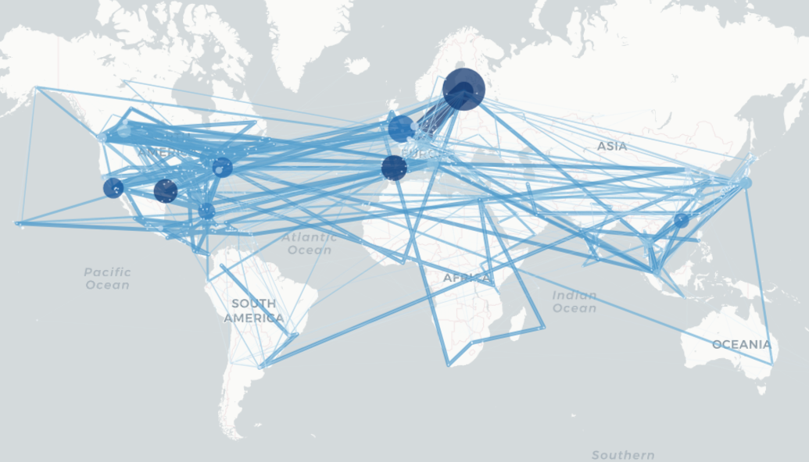
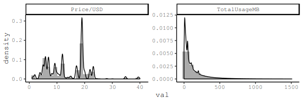
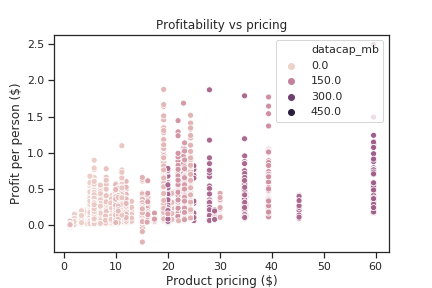
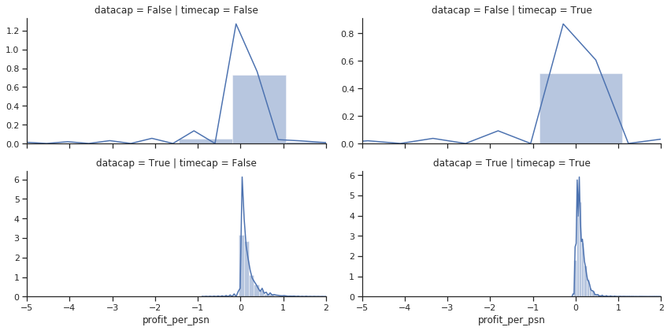
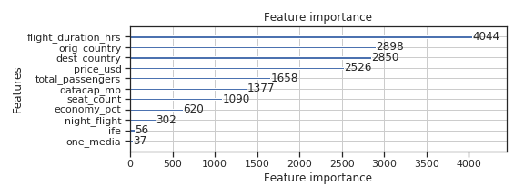
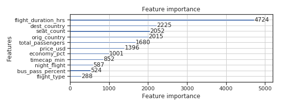
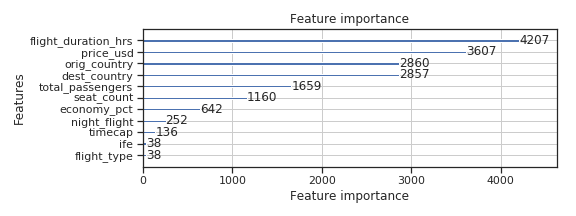

```{r setup, include=FALSE}
knitr::opts_chunk$set(echo = FALSE, message = FALSE, cache = TRUE, 
                      fig.pos = 'h', eval=FALSE)
knitr::opts_knit$set(root.dir = rprojroot::find_rstudio_root_file())
```

```{r}
library(tidyverse)
library(knitr)
library(pander)
library(lubridate)
library(grid)
```


```{r df_read, include=FALSE, eval=FALSE}
source("R/data_reader.R")
df_full = data_reader("data/df_rfp_dataset_raw_20181218185047.csv",
                      data_ref = "data/data_reference.csv")
```


## 1. Introduction
Dynamic pricing is a pricing policy in which a firm adjusts the price of their product as a function of its perceived demand in order to maximize profit. A common challenge when applying machine learning techniques for pricing optimization is the lack of past observations. The specific problem of inflight WiFi pricing optimization is no exception. While Panasonic collects millions of transaction per year from its wide network of partner airlines, the actual number pricing policies for learning consumer behavior are much more limited if we consider regional, product and hardware differences. Fortunately, if we strategically generalize some of the variables, we can create opportunities for learning.

From literature research, we choose to adopt a two-staged framework to tackle this problem. First, a demand, or price-response model is built to understand the effect of the different factors. Then, a dynamic pricing model is built to find the optimal pricing. The appeal aspect of this framework is that the problem is broken down into two independent stages. For this project, we can build upon any prior work done on the demand model; conversely, improvements to the demand model can be made without changing the pricing solver. Finally, it provides an evaluation scheme for validation and future improvements.


## 2. Data Description

The dataset we analyzed consists of 4.1 million distinct in-flight internet sessions purchased by customers on airlines partnered with Panasonic Avionics from November 2016 to November 2018. In table 1, the number of unique sessions, flights, geographic factors are listed.

```{r table_unqiue, eval=FALSE}
count_distinct = function(x) length(unique(x))

df_full %>% 
    select(SessionID, FlightID, UserID, Routes, OriginIATA, DestinationIATA, Orig_Country, Dest_Country, Airline) %>% 
    summarise_all(count_distinct) %>% 
    t() %>% 
    pander(caption = "Unqiue factors")

```

--------------------- ---------
    **SessionID**      4181197 

    **FlightID**       567089  

     **UserID**        1142383 

     **Routes**         3048   

   **OriginIATA**        452   

 **DestinationIATA**     439   

  **Orig_Country**       137   

  **Dest_Country**       138   

     **Airline**         23    
--------------------- ---------

Table: Unqiue factors

In addition to the factors above, the dataset also include information such as number of passengers on flight, product pricing, product names, aircraft type, entertainment options.

To understand the geographic distribution, a network graph of the wifi sessions was generated in fig. 1. The node and edge weights were based on the number of wifi sessions purchased. We can see that although there were more than 3400 hundred routes, the majority of wifi sessions associated with Panasonic partners were heavily concentrated in North America and selected European cities.

The most crucial pieces of information would be the price paid and the data consumption by the consumer, as these variable gave us a direct link to the revenue and cost associated with providing in-flight wifi services. Distribution of these two key variables are show in fig. 2, with the top 0.5% removed to avoid outliers. The distribution of the price paid revealed one of the key data challenge to this project: the lack of pricing variation.  With 23 partner airlines, and roughly 3 to 5 unique products per flight route, the distribution of the pricing was unevenly concentrated in a few particular price points between $5 to $20 USD. 

```{r}
df_full %>% 
  select(`Price/USD`, TotalUsageMB) %>% 
  filter_all(all_vars(. < quantile(., .995))) %>% 
  gather(var, val) %>% 
  ggplot(aes(val)) +
  geom_histogram(aes(y = ..density..), alpha = 0.5) +
  geom_density() +
  facet_wrap(~var, scales = 'free') +
  labs(title = 'Distribution of price paid and data usage (top 0.05% trimmed)')
```


{width='600px'}



\pagebreak

## 3. Modeling approach
#### Demand model
We have found a wide variety of demand model specifications. Parametric models from the generalized linear model family are well studied and their success depends on whether their assumptions are met.  In addition, their gradient are relatively easy to obtain, allowing optimising problems to be solved. On the other hand, powerful machine learning techniques such as random forest or neural networks can also be employed, but additional optimization problem can become challenging.

The goal for the demand model is to capture the most important factors that influence demand.

$$
    Q_t = \psi_t (P_1, P_2, ..., P_N),
$$

here $Q$ is the total sales and $\psi(.)$ is the demand function at time $t$.  $\psi(.)$ can take on any functional form.

Previously, Panasonic data science team have built a successful demand model based on random forest. They have found that the take rate/sales per flight for their products depend greatly on covariates such as the number of passengers, flight route, red-eye, etc. To estimate demand difference, for example between regular vs red-eye flights, we can check model prediction by holding other factors constant.


#### Common pricing optimization model
While a demand model can provide prediction on demand and easily solve for pricing that maximizes revenue, total profit needs to be separately calculated.  When cost is unrelated to the covariates that drive the demand model, the optimization problem can be formulated as:

$$
    \underset{P_1,\dots,P_N}{\max}   \Pi = \sum_{i=1}^N [\psi_t (P_1, P_2, \dots, P_N)(P_t - C_t)]
$$
where $\Pi$ is the total profit across a planning horizon, as a function of a et of pricing $P_1, \dots, P_N$, and average price and cost $P_t$, $C_t$.

This is a common approach to a dynamic pricing optimzation problem and one that we initially considered.

Early in our research process, we proposed to use evolutionary algorithms (EA) to optimize the model above. However, because our model now needs to predict demand both in the form of purchases and data consumption simultaneously, we adjusted our approach, and combine the two directly into a single profit feature.


#### Final approach 
Because data usage spanned such a wide range, we must incoporate cost into modeling consideration and the optimization problem needs to be adjusted.

For cost estimation, we will assume a linear relationship between customer data usage and true cost. This functional relationship base on actual business situation and can be included as a functional parameter. In addition, capacity and pricing limiting constraints can be imposed. In figure 2, we can see that the data usage distribution was smooth and concentrated around 100MB per session. 

Therefore, our goal became:
$$
     \underset{P_1,\dots,P_N}{\max}   G_t = \psi_t (P_1, P_2, ..., P_N),  \qquad \text{for all P's}
$$

here $G$ is the gross profit and $\psi(.)$ is a demand function at time $t$.  $\psi(.)$ can take on any functional form.

Finally, to generate recommendation for pricing, we then use grid search to find the best pricing at a few fixed product specifications.


## 4. Data preparation
#### Predictive model target 
The dataset provided us pricing and usage data at the user level. With a constant per-megabyte cost of data, we are able to calculate the profit-per-session of each session of data usage.  

To also capture the demand in our model target, we must also calculate the amount of purchases. We decided to approach this at a flight level. Using the estimated figure for total passengers on each flight, we calculate the rate of profit as: 

$$
\text{profit per person} = \frac{\text{total revenue} - \text{total cost} }{\text{total passengers}}
$$

{height='250px'}

#### Feature engineering 

A piece of information that we found to have significant effect on model result is the data and time allowance. By extracting the numerical values from the product name, we gained two powerful features that would prove to improve model performance greatly.

Tables 2 and 3 below show examples of the feature extraction and the number of products that have the relevant information.

```{r}
df_full %>% 
  select(ProductName, CapData_MB, CapTime_Min) %>% 
  rename("datacap (MB)" = CapData_MB, "timecap (min)" = CapTime_Min) %>% 
  distinct() %>% 
  sample_n(6) %>% 
  pander()


df_full %>% 
  select(ProductName, CapData_MB, CapTime_Min) %>% 
  distinct() %>% 
  count(!is.na(CapData_MB), !is.na(CapTime_Min)) %>% 
  pander()
```

----------------------------------------------------------
        ProductName          datacap (MB)   timecap (min) 
--------------------------- -------------- ---------------
          1 hour                  -             60       

       10 MB of Data              10             -       

 50MB data usage within 24        50             -       

 Flight Pass (over 6 hours        -             360      

     30 Minutes - $10             -             30       

   flight plan domestic           -             -       
----------------------------------------------------------
Table: Example of feature extraction from product name

Fig.4 show the distribution of the profit per person (per product and flight) mostly ranges between -$2 to $1 per person.  For products that have data cap explicitly specified, they essentially always break even. On the other hand, products without a data cap can potentially lose money.

{height='250px'}


#### Missing data and imputation
```{r}
prop_mis = function(x) paste0(round(sum(is.na(x)) / length(x) * 100, 2), '%')

df_full %>% 
  select(TotalPassengers, CapData_MB, CapTime_Min, FlightType, NightFlight, IFE, eXTV, eXPhone) %>% 
  summarise_all(prop_mis) %>% 
  t() %>% 
  pander()
```


In general, the data set did not suffering from missing data greatly. The most critical feature that has missing data is `total passengers`. Without this information, we cannot generate our model target and this must be imputed.
We chose to impute with those sessions with the median of that airline and aircraft type. 

Also, close to 0.1% of flights indicate that there were more passengers than seats available, which is nonsensical. In these cases we replace the value with the median number of passengers for that aircraft type.

For night flights, which is a categorical feature for which roughly 10% are missing, we also impute by defaulting to false. For international flight, of which approximately 3% are of unknown status, we impute by examining the origin and destination countries.

For all boolean features describing amenities such as in-flight entertainment, TV available, and assorted luxury items, of which less than 1% are missing, we impute by defaulting to false.


------------------------------------ --------------------
 **Total Passengers**                     2.77%  
                
 **Data cap(MB)**                        71.74% 
                
 **Time cap(min)**                       62.07% 
                
 **Flight Type**                        2.77%  
                
 **Night Flight**                       10.59% 

 **In flight entertainment**              0.07%  
     
 **TV**                                  0.07%  
                    
 **Phone**                            0.07%  
------------------------------------ --------------------
Table: Proportion of missing data 

```{r}
df_full %>% 
  select(CapData_MB, CapTime_Min) %>% 
  mutate(hasData = ifelse(!is.na(CapData_MB), 1, 0), hasTime = ifelse(!is.na(CapTime_Min), 1, 0)) %>% 
  mutate(noCap = ifelse(hasData + hasTime == 0, 1, 0)) %>% 
  # mutate(bothCap = ifelse(hasData + hasTime == 2, 1, 0)) %>% 
  count(hasData, hasTime) %>% 
  mutate(percentage = paste0(round(n / sum(n)* 100, 2), '%')) %>% 
  pander()
```


At this point we have a cleaned dataset of flights with identifiable features and imputed values. Unfortunately, only the proportion of observations that have data allowance or time allowance are roughly one-third each. Because they are such important features (see fig. 4), we decided to model these subsets separately. The three subsets are:  

1. Has data cap: indepedent variable includes data cap (mb)
2. Has time cap: indepedent variable includes time cap (min)
3. Full data set: use the boolean flag of whether the product has cap

----------------------------------------------------------
 hasDataCap   hasTimeCap      n      percentage 
------------ ------------ --------- ------------
    0         0            1566602     37.46%   
      
    0         1            1433085     34.27%   
      
    1         0            1029065     24.61%   
      
    1         1            152794      3.65%    
---------------------------------------------------------
Table: Proportion of data with data/time allowance 


## 5. Gradient Boosting/lightGBM


LightGBM is a gradient boosting framework that uses tree-based learning algorithm. It was designed for distributed training and it splits the tree leaf wise with the best fit. The framework is fast and lower memory usages. The gradient boosting has two primary method: bagging and boosting. Bagging involves the training of independent models and combines their prediction. When we want to reduce the variance of decision tree, we used bagging and random forest is one of the example. If single model has low performance, bagging will not get a better bias, but boosting could generate a combined model with lower error. Both are good at reducing variance and provide higher stability, however, if the single model is overfitting, bagging would be the best option.

When we consider decision trees, we start with an $F_0$(initial fit)
The constant value that minimize the loss function L is:

$$
    F_0(x)=argmin_{\rho}\sum_{i=1}^nL(y_i,\rho)
$$
In the case of optimizing the MSE, we take the mean of the target values
$F_0(x)=\dfrac{1}{n}\sum_{i=1}^ny_i$

Calculate pseudo residual with initial guess of $F_0$

$$
    r_{i1}=-\dfrac{\partial L(y_i,F_{0}(x_i))}{\partial F_{0}(x_i)}
$$

Now, we can fit the decision tree $h_1(x)$ to the residuals .
In order to minimize the loss for each leaf, we apply gradient descent  by stepping in the direction of average gradient for the leaf nodes from the decision tree $h_1(x)$ yielding a new boosted fit of the data:
    $F_1(x)=F_{0}(x)+\lambda_1\rho_1h_1(x)$ where $\lambda_1$ is learning rate

#### Gradient Boosting Algorithm
Let M be a number of boosting rounds and L be a differential loss function L:
    $$
    F_0(x)=arg_r min\sum_{i=1}^nL(y_i,\gamma)
$$
For m=1 to M

Calculate the pseudo residuals
$$
    \overset{\sim}{y_{i}}=-\dfrac{\partial L(y_i,F_{m-1}(x_i))}{\partial F_{m-1}(x_i)}
$$
Fit decision tree $h_m(x)$ to $\overset{\sim}{y_{i}}$
Compute the step multiplier $\rho_m$ for each leaf of $h_m(x)$
Let $F_m(x)=F_{m-1}(x)+\lambda_m\rho_mh_m(x)$ where $\lambda_m$ is the learning rate for iteration m.

We chose to use lightGBM for two main reasons:

1. Its ability to handle categorical features directly
2. Its performance in computational time and accurarcy  

For our problem, we have found that the geographical features provided a lot of information and wanted to include the country level details. For instance, if we were to use XGBoost, another high performance gradient boosting framework, we would need to use one-hot encoding on the categorical features. With 134 unique originating and destination countries, there would be 268 encoding columns. In contrast, lightGBM allowed categorical feature to be label encoded with a much smaller memory footprint. 


## 6. Results

#### Training

Model fitting was done by using 80:20 train/validate split with 5 fold cross validation.  
Model parameters were searched using randomized grid search.

#### Errors


|Subset         |    Metric             |  Value        |
|---------------|-----------------------|---------------|
|Data capped    |   RMSE                |   0.1522      |   
|Data capped    |   MAE                 |   0.0838      | 
|Time capped    |   RMSE                |   0.4501      |   
|Time capped    |   MAE                 |   0.0839      | 
|Full dataset   |   RMSE                |   0.1551      |   
|Full dataset   |   MAE                 |  0.0840       | 
Table: Proportion of data with data/time allowance 


#### Feature importance

Feature importance here is calculated by the number of times a feature is used in a split. We can see that flight duration is on the very top for all three subsets. This is to be expected, since our model target is the rate of profit per flight generated by a particular product. Naturally, any product have more opportunity to generate revenue given extra exposure.

\pagebreak
{height='200px'}
  
{height='200px'}
  
{height='200px'}


## Next steps
We are currently working on using the tuned model to generate pricing recommendation. For routes with data cap, the pricing policy will include both price and data allowance. For other routes, the recommendation will be pricing only.

\pagebreak
## References
* Ke, G., Meng, Q., Finley, T., Wang, T., Chen, W., Ma, W., Ye, Q., & Liu, T. (2017). LightGBM: A Highly Efficient Gradient Boosting Decision Tree. NIPS.
* Shakya, Kern, Owusu, and Chin. "Neural Network Demand Models and Evolutionary Optimisers for Dynamic Pricing." Knowledge-Based Systems 29 (2012): 44-53. Web.
* Bauer, and Jannach. "Optimal Pricing in E-commerce Based on Sparse and Noisy Data." Decision Support Systems 106 (2018): 53-63. Web.
* Owusu, G., Voudouris, Kern, Garyfalos, Anim-Ansah, and Virginas. "On Optimising Resource Planning in BT Plc with FOS." 2006 International Conference on Service Systems and Service Management 1 (2006): 541-46. Web.
* Shakya, Chin, and Owusu. "An AI-based System for Pricing Diverse Products and Services."
Knowledge-Based Systems 23.4 (2010): 357-62. Web.
* Friedman "Greedy Function Approximation:A Gradient Boosting Machine." (2001): Web.


<!-- #### Outline of EA -->
<!-- EAs are a family of population based optimization techniques. They use the concept of natural selection and random variation to evolve better solutions to the problem. EAs are advantageous for two reasons. First, they do not depend on the functional form of the demand model and can thus be used to optimize a wide variety of complex models. Second, they have the ability of simultaneously searching over a wide range of possible solutions, and are thus more likely to converge toward a global maximum. -->


<!-- An EA begins by randomly generating a population of pricing policies. Our pricing policy would be a combination of prices and the relevant flight factors. Each policy would be evaluated on its profitability using the demand model. Then, subsets of good policies are selected and is used to generate new policies. This process is repeated until a termination criterion is met. -->
<!-- Popular examples of EAs include the genetic algorithm (GA) which relies on crossover and mutation operators. A crossover operator randomly selects two policies from the subset of best policies and combines them in order to create an even better solution. Similarly, the mutation operator introduces additional variation by slightly modifying a policy in order to search unexplored parts of the sample space. Another type of EA are Estimation of Distribution Algorithms. EDAs take a more probabilistic approach. They build a probabilistic model of solutions and sample the model to generate the new child population. The two EDAs we are considering using are: Population Based Incremental Learning (PBLT) and Distribution Estimation using Markov random fields (DEUMd) The EDAs that we are considering can be classified as univariate EDA where the variables in the problem space are considered independent from each other. For the problem of internet pricing optimization, it is suitable when we are only considering pricing change. We have also found extensions of EDA that can take into consideration of multivariate interactions, which can be useful if we are interested in optimizing both pricing and data cap limit. -->


<!-- #### Outline of evolutionary algorithm workflow -->
<!-- An EA begins by randomly generating a population of pricing policies. Our pricing policy would be a combination of prices and the relevant flight factors. Each policy would be evaluated on its profitability using the demand model. Then, subsets of good policies are selected and is used to generate new policies. This process is repeated until a termination criterion is met. -->

<!-- Popular examples of EAs include the genetic algorithm (GA) which relies on crossover and mutation operators. A crossover operator randomly selects two policies from the subset of best policies and combines them in order to create an even better solution. Similarly, the mutation operator introduces additional variation by slightly modifying a policy in order to search unexplored parts of the sample space. -->


<!-- #### Genetic algorithm -->
<!-- 1. Generate a population P consisting of M solutions -->
<!-- 2. Build a breeding pool by selecting promising solutions from P -->
<!-- 3. Perform crossover on the breeding pool to generate a population of new solutions -->
<!-- 4. Perform mutation on the new solutions -->
<!-- 5. Replace P by the new solution and go to step 2. Repeat this process until the termination criteria is met -->


<!-- #### Estimation of distribution algorithms (EDA) -->
<!-- Another type of EA are Estimation of Distribution Algorithms. EDAs take a more probabilistic approach. They build a probabilistic model of solutions and sample the model to generate the new child population. The two EDAs we are considering using are: -->

<!--     * Population Based Incremental Learning (PBLT) -->
<!-- * Distribution Estimation using Markov random fields (DEUMd) -->

<!-- The steps of the PBLT algorithm are shown below: -->

<!-- 1. Initialize a probability vector $p = p_1, .., p_n$ with each $p_i = 1/2$, where $p_i$ represent the probability of $x_i$ taking value 1 in the solution. -->
<!-- 2. Generate a population P consisting of M solutions by sampling probabilities in p. -->
<!-- 3. Select set D from P consisting of N promising solutions where $N<M$ -->
<!-- 4. Estimate the marginal probabilities of $x_i = 1$ as -->
<!-- $$ -->
<!--     p(x_i = 1) = \frac{\sum_{x \in D} x_i}{N} -->
<!-- $$ -->
<!-- 5. Update each $p_i$ in p using $p_i = p_i + \lambda(p(x_i = 1) - p_i)$ where $\lambda  \in [0,1]$ is the learning rate parameter -->
<!-- 6. Go to step 2 and repeat until termination criteria are met -->

<!-- The EDAs that we are considering can be classified as univariate EDA where the variables in the problem space are considered independent from each other. For the problem of internet pricing optimization, it is suitable when we are only considering pricing change. We have also found extensions of EDA that can take into consideration of multivariate interactions, which can be useful if we are interested in optimizing both pricing and data cap limit. -->


<!-- ## Evaluation -->
<!-- Although optimal pricing can be solved using EA based techniques, the accuracy of the demand model is equally critical and they must be evaluated together. -->

<!-- An proposed evaluation scheme for this problem: -->

<!-- 1. Data simulation -->
<!-- i. Split existing data using decision trees into different scenarios -->
<!-- ii. Under each scenario, generate 60 pricing representing 60 weeks of data -->
<!-- iii. Estimate the corresponding demand with the demand model -->
<!-- 2. Optimization and demand model evaluation -->
<!-- i. Generate true optimal pricing by using the data generating model as input -->
<!-- ii. Re-fit demand models using simulated data. Solve for optimal pricing under the simulated demand models -->
<!-- 3. Evaluate performance of the overall optimization by comparing the difference in prices (RMSE) obtained from 2-i and 2-ii. -->
